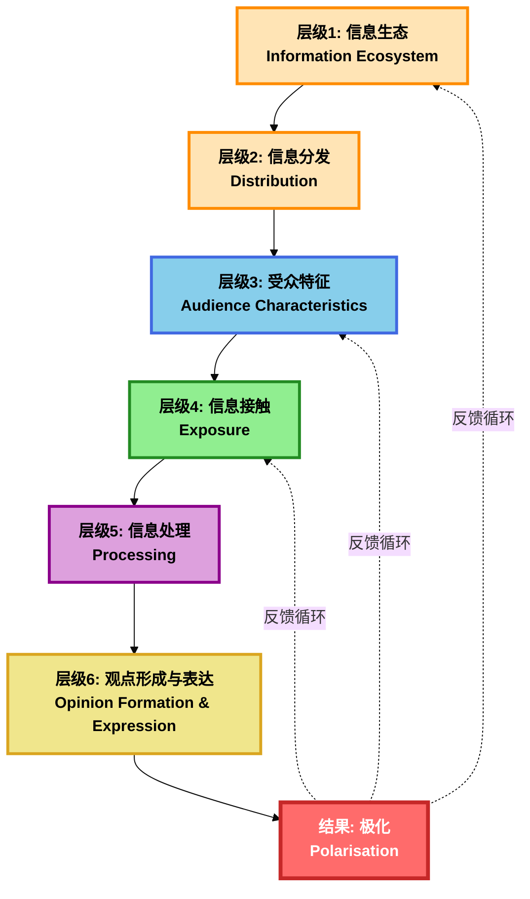
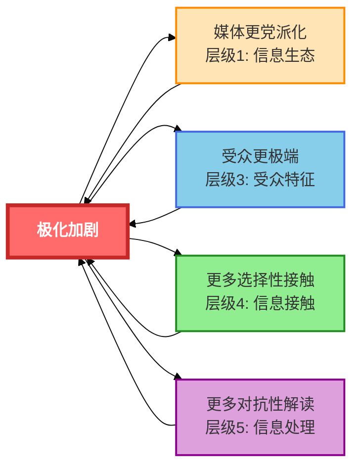

# 极化机制层级框架
## Polarisation Mechanism Framework

---

## 📋 框架概述

本框架将**观点极化的形成机制**分解为**6个理论层级**，用于指导文献研究和平台设计。

### 核心问题
如何从信息生态到最终极化，中间经历了哪些关键环节？每个环节对应什么理论？

---

## 🔄 完整机制链条



---

## 📊 层级1: 信息生态 (Information Ecosystem) 🌐

### 核心问题
**信息本身的特征是什么？**

### 研究维度

| 子维度 | 研究问题 | 相关理论 | 文献研究优先级 |
|--------|---------|---------|---------------|
| **媒体党派性** | 新闻来源是否有党派倾向？<br/>党派媒体的特征是什么？ | • 党派媒体理论<br/>• 媒体偏见研究 | 🟡 中优先级 |
| **信息框架** | 信息如何被框架化？<br/>冲突框架 vs 共识框架？ | • 框架理论 (Framing Theory)<br/>• 媒体框架分析 | 🔴 高优先级<br/>Lit6相关 |
| **内容多样性** | 信息来源的意识形态多样性如何？<br/>是否存在观点垄断？ | • 多元主义理论<br/>• 信息多样性研究 | 🟡 中优先级 |
| **精英暗示** | 政治精英如何塑造信息？<br/>媒体如何转述精英观点？ | • 精英理论<br/>• 议程设置理论 (Agenda-Setting) | 🔴 高优先级<br/>Lit4相关 |

### 已有研究发现（来自Arguedas2021）
- ✅ **精英暗示是极化的重要驱动力** (p.28)
  - 政治精英的行为往往是导致极化的因素
- ✅ **党派媒体确实会增加极化** (p.28)
  - 接触党派性新闻和媒体能增加极化

### 设计启示
- ⚠️ 平台的内容选择必须避免成为"另一个党派媒体"
- 💡 需要系统性地选取多样化的信息来源
- 💡 可以"去精英化"，提供自下而上的公民叙事

---

## 📊 层级2: 信息分发 (Distribution) 📡

### 核心问题
**信息如何到达受众？谁决定了信息的可见性？**

### 研究维度

| 子维度 | 研究问题 | 相关理论 | 文献研究优先级 |
|--------|---------|---------|---------------|
| **算法机制** | 算法如何排序和推荐信息？<br/>个性化推荐的逻辑是什么？ | • 算法治理理论<br/>• 推荐系统研究 | 🔴 高优先级 |
| **把关人角色** | 谁在筛选信息？<br/>编辑 vs 算法 vs 社交网络？ | • 把关人理论 (Gatekeeping Theory)<br/>• 新把关人研究 | 🔴 **最高优先级**<br/>Lit4 |
| **议程设置** | 什么议题被凸显？什么被忽略？<br/>如何塑造"重要性"？ | • 议程设置理论 (Agenda-Setting)<br/>• 二级议程设置 | 🔴 **最高优先级**<br/>Lit4 |
| **平台设计** | 平台的UX如何影响信息可见性？<br/>界面设计如何塑造注意力？ | • 平台治理研究<br/>• 注意力经济理论 | 🟠 高优先级 |

### 已有研究发现（来自Arguedas2021）
- ✅ **算法通过"偶然接触"增加了多样性，而非减少** (p.28)
  - 搜索引擎和社交媒体的算法排名反而增加了新闻多样性
- ✅ **"过滤气泡"假说被证伪** (p.28, p.36)
  - 没有证据支持算法导致信息茧房

### 设计启示
- 💡 **核心策略：增强算法中已被证明有效的"偶然接触"机制**
- 💡 设计"自动的机缘巧合" (automated serendipity)
- ⚠️ 不要试图"修复"一个不存在的技术问题（过滤气泡）

### 需要研究的文献（Lit4）
- [ ] 把关人理论 (Gatekeeping Theory) 的经典文献
- [ ] 议程设置理论 (Agenda-Setting Theory) 的核心研究
- [ ] 算法推荐与信息多样性的实证研究
- [ ] 平台架构如何影响信息分发的案例研究

---

## 📊 层级3: 受众特征 (Audience Characteristics) 👤

### 核心问题
**受众自身带来了什么？他们的起点是什么？**

### 研究维度

| 子维度 | 研究问题 | 相关理论 | 文献研究优先级 |
|--------|---------|---------|---------------|
| **先有态度** | 受众的政治立场、价值观、世界观是什么？<br/>这些如何影响信息接受？ | • 态度理论<br/>• 社会认同理论 (Social Identity Theory) | 🟢 博士阶段<br/>Lit13相关 |
| **认知风格** | 受众的批判性思维能力、认知复杂度如何？<br/>是否有认知开放性？ | • 认知风格理论<br/>• 认知复杂度研究 | 🟡 中优先级 |
| **动机与需求** | 受众为什么寻求信息？<br/>求知 vs 确认偏误 vs 娱乐？ | • 使用与满足理论 (Uses & Gratifications)<br/>• 动机性推理 (Motivated Reasoning) | 🟢 博士阶段<br/>Lit13相关 |
| **群体认同** | 受众如何定义"我们"和"他们"？<br/>政治身份认同的强度如何？ | • 社会认同理论 (Social Identity Theory)<br/>• 内群体偏好理论 | 🟢 博士阶段<br/>Lit13相关 |

### 已有研究发现（来自Arguedas2021）
- ✅ **自我选择（基于党派和兴趣）是关键驱动力** (p.28)
  - 少数高度党派化的人主动选择进入回音室
  - 需求（Demand）是主因，而非供给（Supply）或分发（Distribution）

### 设计启示
- 💡 **核心策略："劫持"用户的自我选择**
  - 不是对抗用户动机，而是利用它
  - 从用户关心的议题出发，渐进式引入多样观点
- 💡 分群设计：为不同认知风格和动机的用户提供不同路径
- ⚠️ 承认局限：你无法改变受众的先有态度，只能在此基础上设计

### 需要研究的文献（Lit13 - 博士阶段）
- [ ] 社会认同理论 (Social Identity Theory) 的核心文献
- [ ] 动机性推理 (Motivated Reasoning) 的最新研究
- [ ] 群体认同与极化关系的实证研究
- [ ] 认知风格与信息处理的心理学研究

---

## 📊 层级4: 信息接触 (Exposure) 👁️

### 核心问题
**受众实际接触到了什么信息？如何接触的？**

### 研究维度

| 子维度 | 研究问题 | 相关理论 | 文献研究优先级 |
|--------|---------|---------|---------------|
| **选择性接触** | 受众是否主动选择同质信息？<br/>确认偏误在接触阶段如何体现？ | • 选择性接触理论 (Selective Exposure)<br/>• 确认偏误 (Confirmation Bias) | 🔴 **最高优先级**<br/>Lit5 |
| **偶然接触** | 受众是否"意外"接触到异见？<br/>偶然接触的条件是什么？ | • 偶然接触理论 (Incidental Exposure)<br/>• 机缘巧合机制 (Serendipity) | 🔴 **最高优先级**<br/>Lit5 |
| **接触类型** | 接触的是"志同道合"还是"交叉观点"？<br/>交叉曝光的效果如何？ | • 交叉曝光理论 (Cross-cutting Exposure)<br/>• 异质性接触研究 | 🔴 **最高优先级**<br/>Lit5 |
| **接触强度** | 接触的频率、时长、深度如何？<br/>剂量效应如何体现？ | • 剂量效应理论<br/>• 信息暴露强度研究 | 🟡 中优先级 |

### 已有研究发现（来自Arguedas2021）
- ✅ **算法通过"偶然接触"和"机缘巧合"增加多样性** (p.17, p.28)
  - 这是被证明有效的机制
- ✅ **大多数人不会主动避免反面观点** (p.20)
  - 没有证据表明他们会避免令人反感的信息
- ⚠️ **【警告】交叉曝光也可能加剧极化** (p.28)
  - 对于强党派人士，接触对立观点可能适得其反

### 设计启示
- 💡 **核心策略：设计"偶遇式曝光"，而非"对抗式曝光"**
  - ✅ 好的设计：时间延迟、去标签化、兴趣桥接
  - ❌ 坏的设计：A vs B 观点并列、"左派/右派"标签、强制曝光
- 💡 你的平台对大多数人是可行的，因为他们本就不排斥多样化观点
- ⚠️ 必须避免简单的"交叉曝光"（cross-cutting exposure）

### 需要研究的文献（Lit5）
- [ ] 选择性接触理论 (Selective Exposure) 的经典文献
- [ ] 确认偏误 (Confirmation Bias) 的心理学机制
- [ ] 偶然接触 (Incidental Exposure) 的实证研究
- [ ] 交叉曝光 (Cross-cutting Exposure) 的效果与边界条件
- [ ] "机缘巧合"设计的案例研究

---

## 📊 层级5: 信息处理 (Processing) 🧠

### 核心问题
**受众如何解读和加工接触到的信息？**

### 研究维度

| 子维度 | 研究问题 | 相关理论 | 文献研究优先级 |
|--------|---------|---------|---------------|
| **认知路径** | 受众是深度思考还是浅层处理？<br/>中心路径 vs 边缘路径？ | • 详尽可能性模型 (ELM - Elaboration Likelihood Model)<br/>• 双过程理论 | 🔴 **最高优先级**<br/>Lit6 |
| **框架解读** | 受众如何理解信息的框架？<br/>框架如何影响态度？ | • 框架理论 (Framing Theory)<br/>• 框架效应 (Framing Effects) | 🔴 **最高优先级**<br/>Lit6 |
| **确认偏误** | 受众是否只接受符合预期的信息？<br/>如何处理不一致的信息？ | • 确认偏误理论 (Confirmation Bias)<br/>• 认知失调理论 (Cognitive Dissonance) | 🔴 高优先级<br/>Lit5, Lit6 |
| **对抗性解读** | 受众是否"反向解读"对立观点？<br/>防御性处理的条件是什么？ | • 对抗性解读理论 (Oppositional Reading)<br/>• 防御性加工 (Defensive Processing) | 🔴 **最高优先级**<br/>Lit7 |
| **认知负荷** | 信息是否让受众感到过载？<br/>如何简化复杂信息？ | • 认知负荷理论 (Cognitive Load Theory)<br/>• 信息过载研究 | 🔴 **最高优先级**<br/>Lit6 |
| **情感反应** | 信息引发了什么情感？<br/>愤怒、恐惧、同理心如何影响判断？ | • 情感传播理论<br/>• 情感与说服研究 | 🟡 中优先级 |

### 已有研究发现（来自Arguedas2021）
- ⚠️ **对立观点可能引发"对抗性解读"，加剧极化** (p.23)
  - 暴露于令人反感的对立观点可能适得其反

### 设计启示
- 💡 **核心策略：情境化呈现，减少对抗性解读**
  - 不要简单罗列对立观点
  - 提供情境、背景、共同价值观框架
  - 避免认知过载
- 💡 引导用户走中心路径（深度思考），而非边缘路径（启发式）
- 💡 设计元认知提示，促进批判性思维

### 需要研究的文献（Lit6）
- [ ] 详尽可能性模型 (ELM) 的经典文献
- [ ] 框架理论 (Framing Theory) 的核心研究
- [ ] 认知负荷理论 (Cognitive Load Theory) 的应用
- [ ] 框架效应与情境化呈现的实证研究
- [ ] 对抗性解读 (Oppositional Reading) 的机制研究

---

## 📊 层级6: 观点形成与表达 (Opinion Formation & Expression) 💬

### 核心问题
**受众形成了什么观点？如何表达？如何与他人互动？**

### 研究维度

| 子维度 | 研究问题 | 相关理论 | 文献研究优先级 |
|--------|---------|---------|---------------|
| **观点固化** | 受众的观点是否变得更极端？<br/>群体讨论如何加剧极化？ | • 群体极化理论 (Group Polarisation)<br/>• 极化机制研究 | 🔴 高优先级 |
| **表达意愿** | 受众是否愿意公开表达观点？<br/>哪些人选择沉默？ | • 沉默的螺旋理论 (Spiral of Silence)<br/>• 自我审查研究 | 🔴 **最高优先级**<br/>Lit7 |
| **舆论气候感知** | 受众如何感知"主流观点"？<br/>多数派 vs 少数派的感知差异？ | • 舆论气候理论<br/>• 多元无知 (Pluralistic Ignorance) | 🔴 **最高优先级**<br/>Lit7 |
| **在线互动** | 受众在网络上如何与他人互动？<br/>建设性对话 vs 对抗性辩论？ | • 计算机中介传播理论 (CMC)<br/>• 审议式民主研究 | 🔴 高优先级<br/>Lit12 |
| **回音室形成** | 受众是否进入封闭的回音室？<br/>回音室的形成条件是什么？ | • 回音室理论 (Echo Chamber Theory)<br/>• 在线社群研究 | 🟡 中优先级 |

### 已有研究发现（来自Arguedas2021）
- ✅ **回音室实际上很罕见（~6-8%）** (p.24)
  - 只有少数高度党派化的人处于回音室中
- ✅ **少数活跃、固执己见的人主导了在线讨论** (p.29)
  - 绝大多数互联网用户几乎不关注这些党派性讨论

### 设计启示
- 💡 **核心策略：去互动化 or 结构化互动**
  - 避免设置自由评论区（防止少数极端者劫持讨论）
  - 如果要互动，采用结构化对话设计（如审议式民主）
- 💡 避免"沉默的螺旋"：不显示点赞数、不排序评论
- 💡 你的平台是为"沉默的大多数"设计的，而非少数活跃者

### 需要研究的文献（Lit7）
- [ ] 沉默的螺旋理论 (Spiral of Silence) 的经典文献
- [ ] 舆论气候感知的最新研究
- [ ] 对抗性解读机制的心理学研究
- [ ] 在线讨论的极化动力学
- [ ] 审议式民主 (Deliberative Democracy) 的在线实践（Lit12）

---

## 🎯 结果: 极化 (Polarisation) 🔴

### 核心问题
**什么类型的极化产生了？如何测量？**

### 极化类型

| 极化类型 | 定义 | 测量方式 | 当前趋势 |
|---------|------|---------|---------|
| **意识形态极化**<br/>(Ideological Polarisation) | 观点分歧的程度<br/>"我们在政治议题上有多不同？" | • 政治立场量表<br/>• 议题态度距离 | 📉 在许多国家**下降** |
| **情感极化**<br/>(Affective Polarisation) | 对"另一方"的厌恶程度<br/>"我有多讨厌他们？" | • 情感温度计 (Feeling Thermometer)<br/>• 社会距离量表 | 📈 在某些国家**上升** |
| **行为极化**<br/>(Behavioral Polarisation) | 极端行为的增加<br/>如网络暴力、排斥行为 | • 行为数据分析<br/>• 社交网络分析 | 🔍 研究不足 |

### 已有研究发现（来自Arguedas2021）
- ✅ **意识形态极化在一些国家下降，情感极化在上升** (p.28)
- ✅ **极化没有单一的全球趋势** (p.28)
  - 特定国家因素（而非互联网）是决定性的

### 设计目标
- 🎯 **你的平台应该明确定位：减少情感极化，而非强求意识形态一致**
- 🎯 测量指标：
  - 主要指标：情感极化的变化
  - 次要指标：意识形态多样性的维持
  - 行为指标：建设性对话的比例

---

## 🔄 反馈循环 (Feedback Loops) - 最关键！

极化不是线性的，而是一个**自我强化的循环系统**。

### 循环机制图



### 反馈循环的具体表现

| 循环类型 | 机制描述 | 设计干预点 |
|---------|---------|----------|
| **媒体生态循环** | 极化受众 → 需求党派媒体 → 媒体更党派化 → 极化加剧 | 提供非党派化的信息来源选择 |
| **受众自我强化** | 极化态度 → 更强的群体认同 → 更极端的观点 → 极化加剧 | 建立跨党派的共同认同框架 |
| **选择性接触循环** | 极化观点 → 回避异见 → 接触同质信息 → 极化加剧 | 设计"偶遇式曝光"打破循环 |
| **对抗性解读循环** | 极化情绪 → 敌意解读对方 → 情感极化加剧 → 更敌意 | 情境化呈现，减少防御性 |

### 设计的核心任务
**不是单点干预，而是打破多个层级的反馈循环。**

---

## 📚 文献研究优先级总结

### 🔴 最高优先级（立即开始，6周内完成）

| 文献研究编号 | 对应层级 | 核心理论 | 预计时间 |
|------------|---------|---------|---------|
| **Lit4** | 层级1 + 层级2 | 把关人理论、议程设置理论 | 1周 |
| **Lit5** | 层级4 | 选择性接触理论、确认偏误、偶然接触、交叉曝光 | 1.5周 |
| **Lit6** | 层级5 | 框架理论、认知负荷理论、详尽可能性模型 (ELM) | 1.5周 |
| **Lit7** | 层级6 | 沉默的螺旋理论、舆论气候感知、对抗性解读 | 1.5周 |
| **Lit8** | 跨层级设计转化 | 行为设计学、Nudge理论、说服理论 | 1周 |

**总计：约6周**

---

### 🟡 中优先级（原型设计前，2周内完成）

| 文献研究编号 | 对应层级 | 核心理论 | 预计时间 |
|------------|---------|---------|---------|
| **Lit9** | 层级5设计应用 | 情境效应研究、框架效应案例 | 0.5周 |
| **Lit10** | 层级3 + 设计应用 | 共同内群体认同、道德基础理论 | 0.5周 |
| **Lit11** | 层级5设计应用 | 批判性思维培养、元认知提示研究 | 0.5周 |
| **Lit12** | 层级6设计应用 | 审议式民主实践、在线对话设计案例 | 0.5周 |

**总计：约2周**

---

### 🟢 低优先级（博士阶段持续研究）

| 文献研究编号 | 对应层级 | 核心理论 | 时间节点 |
|------------|---------|---------|---------|
| **Lit13** | 层级3深度研究 | 社会心理机制、群体认同理论、动机性推理 | 博士研究阶段 |

---

## 🎯 从理论层级到设计策略的映射

### 设计策略与层级对应表

| 你的设计策略 | 干预层级 | 核心机制 | 需要的理论支撑 |
|------------|---------|---------|---------------|
| **1. 情境化呈现** | 层级5 (信息处理) | 减少对抗性解读<br/>引导深度思考 | Lit6 (框架理论、ELM)<br/>Lit9 (情境效应) |
| **2. 共同价值观框架** | 层级3 + 层级5 | 建立跨党派认同<br/>弱化"我们vs他们" | Lit10 (共同内群体认同)<br/>Lit13 (群体认同理论) |
| **3. 引导性反思机制** | 层级5 (信息处理) | 促进批判性思维<br/>元认知提示 | Lit6 (认知负荷理论)<br/>Lit11 (元认知提示) |
| **4. 结构化对话设计** | 层级6 (观点表达) | 避免对抗性辩论<br/>促进审议式对话 | Lit7 (沉默的螺旋)<br/>Lit12 (审议式民主) |
| **5. 偶遇式曝光设计** | 层级4 (信息接触) | 利用"机缘巧合"<br/>避免强制交叉曝光 | Lit5 (偶然接触理论)<br/>Lit8 (行为设计学) |
| **6. 去精英化叙事** | 层级1 (信息生态) | 提供多元框架<br/>减少精英暗示影响 | Lit4 (议程设置理论) |

---

## 📖 下一步行动

### 立即开始（本周）
1. 开始 **Lit4** 的文献检索：
   - 关键词：Gatekeeping Theory, Agenda-Setting Theory, News Selection
   - 重点作者：Maxwell McCombs, Pamela Shoemaker, Karine Nahon
   - 寻找5-10篇核心文献

2. 创建文献笔记文件夹结构：
   ```
   01_literature_review/
   ├── layer1_information_ecosystem/
   ├── layer2_distribution/
   ├── layer3_audience_characteristics/
   ├── layer4_exposure/
   ├── layer5_processing/
   └── layer6_opinion_formation/
   ```

### 持续跟踪
- 每完成一个层级的文献研究，更新本框架文档
- 记录新的发现和设计启示
- 调整设计策略与理论映射表

---

## 📝 框架版本信息

- **版本：** 1.0
- **创建日期：** 2025-11-11
- **最后更新：** 2025-11-11
- **状态：** 待讨论和完善

---

## 💬 讨论记录

### 待讨论问题

1. **这6个层级是否涵盖了你想研究的所有维度？**
2. **有没有哪个层级是你觉得不必要的？**
3. **有没有缺失的层级？**
4. **你最想深入研究哪2-3个层级？**
5. **这个分层对你的设计实践有帮助吗？**

### 讨论后的修改记录
（待更新）

---

**文件位置：** `c:\docs\ai-driven-research-workflow\00_study_plan\polarisation_mechanism_framework.md`
