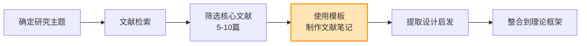

# 研究工作流程图

## 完整研究流程

```mermaid
%%{init: {'theme':'base', 'themeVariables': { 'fontSize':'16px', 'fontFamily':'Arial'}}}%%
flowchart TD
    Start([开始研究]) --> Phase1[步骤一: 文献综述 ✅]

    Phase1 --> Lit1[📚 文献研究:<br/>过滤气泡理论批判]
    Lit1 --> Lit2[📚 文献研究:<br/>传播学理论梳理]
    Lit2 --> Lit3[📚 文献研究:<br/>最新实证研究整合]
    Lit3 --> Output1[输出: 问题定义阶段<br/>文献综述报告]

    Output1 --> Phase2[步骤二: 设计框架开发 🔄]

    Phase2 --> Step2_1[构建用户旅程模型]
    Step2_1 --> Lit4[📚 文献研究:<br/>把关人理论<br/>议程设置理论]
    Lit4 --> Stage1[阶段1: 信息触达与过滤]

    Stage1 --> Lit5[📚 文献研究:<br/>选择性接触理论<br/>确认偏误机制]
    Lit5 --> Stage2[阶段2: 信息选择与接触]

    Stage2 --> Lit6[📚 文献研究:<br/>框架理论<br/>认知负荷理论<br/>详尽可能性模型ELM]
    Lit6 --> Stage3[阶段3: 信息呈现与解读]

    Stage3 --> Lit7[📚 文献研究:<br/>沉默的螺旋理论<br/>舆论气候感知<br/>对抗性解读机制]
    Lit7 --> Stage4[阶段4: 观点形成与互动]

    Stage4 --> Step2_2[理论整合与设计转化]
    Step2_2 --> Lit8[📚 文献研究:<br/>行为设计学<br/>Nudge理论<br/>说服理论]

    Lit8 --> Output2_1[输出1: 用户旅程-理论<br/>整合模型图]
    Output2_1 --> Output2_2[输出2: 模型阐释与<br/>设计转化表]
    Output2_2 --> Output2_3[输出3: 桥接性<br/>理论命题]
    Output2_3 --> Output2_4[输出4: 理论叙事]

    Output2_4 --> Phase3[步骤三: 原型实现]

    Phase3 --> Design1[设计策略1:<br/>情境化呈现]
    Design1 --> Lit9[📚 文献研究:<br/>情境效应研究<br/>框架效应案例]

    Lit9 --> Design2[设计策略2:<br/>共同价值观框架]
    Design2 --> Lit10[📚 文献研究:<br/>共同内群体认同<br/>道德基础理论]

    Lit10 --> Design3[设计策略3:<br/>引导性反思机制]
    Design3 --> Lit11[📚 文献研究:<br/>批判性思维培养<br/>元认知提示研究]

    Lit11 --> Design4[设计策略4:<br/>结构化对话设计]
    Design4 --> Lit12[📚 文献研究:<br/>审议式民主实践<br/>在线对话设计案例]

    Lit12 --> Tech[技术实现:<br/>Java + Angular + MySQL]
    Tech --> Prototype[功能原型完成]

    Prototype --> Phase4[步骤四: 设计论证验证]

    Phase4 --> Expert[专家评估<br/>2-3名传播学/HCI专家]
    Expert --> Feedback[收集反馈:<br/>设计是否充分体现理论]
    Feedback --> Iterate{需要迭代?}

    Iterate -->|是| Phase3
    Iterate -->|否| Phase5[步骤五: 设计文档撰写]

    Phase5 --> Doc1[记录设计决策]
    Doc1 --> Doc2[阐述理论依据]
    Doc2 --> Doc3[说明作用机制]
    Doc3 --> Output5[输出: 完整设计文档]

    Output5 --> Future[未来研究方向<br/>博士阶段]

    Future --> Lit13[📚 持续文献研究:<br/>社会心理机制<br/>群体认同理论<br/>动机性推理]

    Lit13 --> Future1[用户行为测试]
    Future1 --> Future2[平台效果评估]
    Future2 --> Future3[长期影响追踪]
    Future3 --> End([研究完成])

    %% 文献研究节点样式 - 橙色系
    style Lit1 fill:#FFD700,stroke:#FF8C00,stroke-width:3px,color:#000,font-weight:bold
    style Lit2 fill:#FFD700,stroke:#FF8C00,stroke-width:3px,color:#000,font-weight:bold
    style Lit3 fill:#FFD700,stroke:#FF8C00,stroke-width:3px,color:#000,font-weight:bold
    style Lit4 fill:#FFA500,stroke:#FF4500,stroke-width:4px,color:#fff,font-weight:bold
    style Lit5 fill:#FFA500,stroke:#FF4500,stroke-width:4px,color:#fff,font-weight:bold
    style Lit6 fill:#FFA500,stroke:#FF4500,stroke-width:4px,color:#fff,font-weight:bold
    style Lit7 fill:#FFA500,stroke:#FF4500,stroke-width:4px,color:#fff,font-weight:bold
    style Lit8 fill:#FFA500,stroke:#FF4500,stroke-width:4px,color:#fff,font-weight:bold
    style Lit9 fill:#FFB347,stroke:#FF8C00,stroke-width:3px,color:#000,font-weight:bold
    style Lit10 fill:#FFB347,stroke:#FF8C00,stroke-width:3px,color:#000,font-weight:bold
    style Lit11 fill:#FFB347,stroke:#FF8C00,stroke-width:3px,color:#000,font-weight:bold
    style Lit12 fill:#FFB347,stroke:#FF8C00,stroke-width:3px,color:#000,font-weight:bold
    style Lit13 fill:#F0E68C,stroke:#DAA520,stroke-width:2px,color:#000

    %% 主要步骤节点样式 - 彩色渐变
    style Phase1 fill:#4CAF50,stroke:#2E7D32,stroke-width:4px,color:#fff,font-size:18px,font-weight:bold
    style Phase2 fill:#2196F3,stroke:#1565C0,stroke-width:4px,color:#fff,font-size:18px,font-weight:bold
    style Phase3 fill:#9C27B0,stroke:#6A1B9A,stroke-width:4px,color:#fff,font-size:18px,font-weight:bold
    style Phase4 fill:#FF9800,stroke:#E65100,stroke-width:4px,color:#fff,font-size:18px,font-weight:bold
    style Phase5 fill:#F44336,stroke:#C62828,stroke-width:4px,color:#fff,font-size:18px,font-weight:bold

    %% 输出节点样式 - 蓝色系
    style Output1 fill:#E3F2FD,stroke:#1976D2,stroke-width:2px,color:#000
    style Output2_1 fill:#E3F2FD,stroke:#1976D2,stroke-width:2px,color:#000
    style Output2_2 fill:#E3F2FD,stroke:#1976D2,stroke-width:2px,color:#000
    style Output2_3 fill:#E3F2FD,stroke:#1976D2,stroke-width:2px,color:#000
    style Output2_4 fill:#E3F2FD,stroke:#1976D2,stroke-width:2px,color:#000
    style Output5 fill:#E3F2FD,stroke:#1976D2,stroke-width:2px,color:#000

    %% 阶段节点样式 - 绿色系
    style Stage1 fill:#C8E6C9,stroke:#388E3C,stroke-width:2px,color:#000
    style Stage2 fill:#C8E6C9,stroke:#388E3C,stroke-width:2px,color:#000
    style Stage3 fill:#C8E6C9,stroke:#388E3C,stroke-width:2px,color:#000
    style Stage4 fill:#C8E6C9,stroke:#388E3C,stroke-width:2px,color:#000

    %% 设计策略节点样式 - 紫色系
    style Design1 fill:#E1BEE7,stroke:#7B1FA2,stroke-width:2px,color:#000
    style Design2 fill:#E1BEE7,stroke:#7B1FA2,stroke-width:2px,color:#000
    style Design3 fill:#E1BEE7,stroke:#7B1FA2,stroke-width:2px,color:#000
    style Design4 fill:#E1BEE7,stroke:#7B1FA2,stroke-width:2px,color:#000

    %% 决策节点样式 - 黄色系
    style Iterate fill:#FFF9C4,stroke:#F57F17,stroke-width:3px,color:#000,font-weight:bold

    %% 其他重要节点
    style Start fill:#E8F5E9,stroke:#2E7D32,stroke-width:2px,color:#000
    style End fill:#FFEBEE,stroke:#C62828,stroke-width:2px,color:#000
    style Tech fill:#F3E5F5,stroke:#7B1FA2,stroke-width:2px,color:#000
    style Prototype fill:#F3E5F5,stroke:#7B1FA2,stroke-width:2px,color:#000
    style Expert fill:#FFF3E0,stroke:#E65100,stroke-width:2px,color:#000
    style Feedback fill:#FFF3E0,stroke:#E65100,stroke-width:2px,color:#000
    style Future fill:#E0F7FA,stroke:#00838F,stroke-width:2px,color:#000
    style Future1 fill:#E0F7FA,stroke:#00838F,stroke-width:2px,color:#000
    style Future2 fill:#E0F7FA,stroke:#00838F,stroke-width:2px,color:#000
    style Future3 fill:#E0F7FA,stroke:#00838F,stroke-width:2px,color:#000
    style Step2_1 fill:#E8EAF6,stroke:#3F51B5,stroke-width:2px,color:#000
    style Step2_2 fill:#E8EAF6,stroke:#3F51B5,stroke-width:2px,color:#000
    style Doc1 fill:#FCE4EC,stroke:#C2185B,stroke-width:2px,color:#000
    style Doc2 fill:#FCE4EC,stroke:#C2185B,stroke-width:2px,color:#000
    style Doc3 fill:#FCE4EC,stroke:#C2185B,stroke-width:2px,color:#000
```

## 文献研究节点详细说明

### 📚 已完成的文献研究 (步骤一)

| 编号 | 文献研究主题 | 核心问题 | 状态 |
|------|------------|---------|------|
| Lit1 | 过滤气泡理论批判 | 概念模糊性、实证证据不足 | ✅ 已完成 |
| Lit2 | 传播学理论梳理 | 信息传播、接收、解读的理论基础 | ✅ 已完成 |
| Lit3 | 最新实证研究整合 | 算法、用户行为、极化的实证发现 | ✅ 已完成 |

---

### 📚 当前需要的文献研究 (步骤二: 设计框架开发)

#### 用户旅程各阶段的理论支撑

| 编号 | 文献研究主题 | 对应阶段 | 核心理论 | 设计挑战 |
|------|------------|---------|---------|---------|
| **Lit4** | 把关人理论 议程设置理论 | 阶段1: 信息触达与过滤 | • 把关人理论 (Gatekeeping Theory) • 议程设置理论 (Agenda-Setting Theory) | 如何透明化把关逻辑? |
| **Lit5** | 选择性接触理论 确认偏误机制 | 阶段2: 信息选择与接触 | • 选择性接触理论 (Selective Exposure) • 确认偏误 (Confirmation Bias) | 如何设计有吸引力的异见入口? |
| **Lit6** | 框架理论 认知负荷理论 详尽可能性模型 | 阶段3: 信息呈现与解读 | • 框架理论 (Framing Theory) • 认知负荷理论 (Cognitive Load Theory) • 详尽可能性模型 (ELM) | 如何情境化呈现多元框架? 如何避免认知过载? |
| **Lit7** | 沉默的螺旋理论 舆论气候感知 对抗性解读机制 | 阶段4: 观点形成与互动 | • 沉默的螺旋理论 (Spiral of Silence) • 舆论气候感知 • 对抗性解读 (Oppositional Reading) | 如何减少对抗性解读? 如何促进建设性对话? |

#### 设计转化的理论基础

| 编号 | 文献研究主题 | 核心内容 | 应用目标 |
|------|------------|---------|---------|
| **Lit8** | 行为设计学 Nudge理论 说服理论 | • 行为设计学原理 • Nudge vs 强制 • 说服的双路径模型 | 将理论机制转化为 可操作的设计策略 |

---

### 📚 原型实现阶段的文献研究 (步骤三)

#### 具体设计策略的理论依据

| 编号 | 文献研究主题 | 设计策略 | 研究重点 |
|------|------------|---------|---------|
| **Lit9** | 情境效应研究 框架效应案例 | 情境化呈现 | • 情境如何影响信息解读? • 成功的情境化案例分析 |
| **Lit10** | 共同内群体认同 道德基础理论 | 共同价值观框架 | • 如何建立跨党派的共同认同? • 道德基础理论 (Moral Foundations Theory) |
| **Lit11** | 批判性思维培养 元认知提示研究 | 引导性反思机制 | • 如何通过设计促进批判性思维? • 元认知提示的有效性 |
| **Lit12** | 审议式民主实践 在线对话设计案例 | 结构化对话设计 | • 审议式民主的在线实践 • 建设性对话的设计模式 |

---

### 📚 未来研究方向的文献储备 (博士阶段)

| 编号 | 文献研究主题 | 研究方向 | 时间节点 |
|------|------------|---------|---------|
| **Lit13** | 社会心理机制 群体认同理论 动机性推理 | • 情感极化的心理机制 • 社会认同理论 • 动机性推理 (Motivated Reasoning) | 博士研究阶段 持续进行 |

---

## 文献研究的优先级与时间分配建议

### 🔴 高优先级 (当前立即需要)

**目标**: 完成步骤二——设计框架开发

| 文献研究 | 预计时间 | 产出 |
|---------|---------|------|
| Lit4: 把关人理论、议程设置理论 | 1周 | 阶段1的理论支撑 |
| Lit5: 选择性接触理论、确认偏误 | 1周 | 阶段2的理论支撑 |
| Lit6: 框架理论、认知负荷、ELM | 1.5周 | 阶段3的理论支撑 |
| Lit7: 沉默的螺旋、对抗性解读 | 1.5周 | 阶段4的理论支撑 |
| Lit8: 行为设计学、Nudge、说服理论 | 1周 | 设计转化方法论 |

**总计**: 约6周

---

### 🟡 中优先级 (原型设计前需要)

**目标**: 支撑步骤三——原型实现

| 文献研究 | 预计时间 | 产出 |
|---------|---------|------|
| Lit9: 情境效应研究、框架效应案例 | 0.5周 | 情境化设计依据 |
| Lit10: 共同内群体认同、道德基础理论 | 0.5周 | 价值观框架设计依据 |
| Lit11: 批判性思维培养、元认知提示 | 0.5周 | 反思机制设计依据 |
| Lit12: 审议式民主、在线对话设计 | 0.5周 | 对话设计依据 |

**总计**: 约2周

---

### 🟢 低优先级 (博士阶段储备)

**目标**: 为未来研究奠基

| 文献研究 | 时间 | 产出 |
|---------|------|------|
| Lit13: 社会心理机制深度研究 | 持续进行 | 理论深化与假设提出 |

---

## 文献研究的具体操作建议

### 每个文献研究节点的标准流程

### 关键步骤

1. **文献检索关键词库**
   - 使用 Google Scholar、Web of Science
   - 追踪关键作者的最新研究
   - 查阅综述论文获取文献网络

2. **文献笔记模板应用**
   - 使用你优化后的 `00_create_memo_prompt.md`
   - 特别关注"与我的研究的连接点"部分
   - 重点提取"设计启发"

3. **理论整合**
   - 将每个文献的发现整合到"用户旅程模型"
   - 更新"模型阐释与设计转化表"
   - 提炼"桥接性理论命题"

---

## 总结

### 文献研究节点统计

- ✅ **已完成**: 3个文献研究节点 (Lit1-Lit3)
- 🔴 **高优先级**: 5个文献研究节点 (Lit4-Lit8) — **当前阶段**
- 🟡 **中优先级**: 4个文献研究节点 (Lit9-Lit12) — **原型设计前**
- 🟢 **低优先级**: 1个持续研究 (Lit13) — **博士阶段**

**总计**: 13个文献研究节点

### 当前任务

你现在处于 **步骤二: 设计框架开发** 的起点，需要立即开始的是：

1. **Lit4**: 把关人理论 + 议程设置理论（阶段1理论支撑）
2. **Lit5**: 选择性接触理论 + 确认偏误机制（阶段2理论支撑）

建议从 **Lit4** 开始，因为它是用户旅程的第一个阶段！
